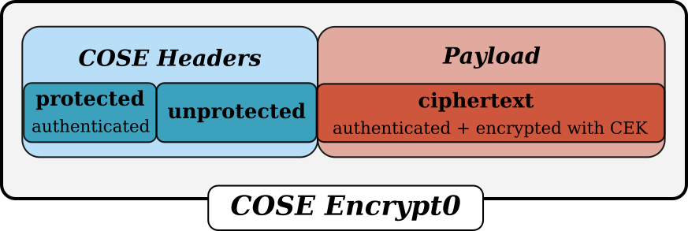

Encrypt0
========

:class:`~cose.messages.enc0message.Enc0Message` messages are used when there is a single receiver. The sender assumes
that the receiver knows how to find/derive the CEK to decrypt the payload. In case there are multiple receivers
(each using a different key) or the receiver requires more information to find/derive the CEK a
:class:`~cose.messages.encmessage.EncMessage` should be used.

.. doctest::

.. module:: cose.messages.enc0message

.. autoclass:: Enc0Message
    :members:
    :inherited-members:
    :exclude-members: from_cose_obj, record_cbor_tag
