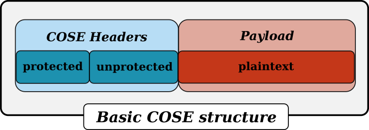

.. pycose documentation master file, created by
   sphinx-quickstart on Fri Aug 21 15:42:18 2020.
   You can adapt this file completely to your liking, but it should at least
   contain the root `toctree` directive.

**********************************************************************
``cose`` a Python implementation of CBOR Object Signing and Encryption
**********************************************************************

What is COSE?
-------------

CBOR Object Signing and Encryption (COSE_) is a data format for concise representation of small messages. It is optimized for
low-power devices. COSE messages can be encrypted, MAC'ed and signed. The basic structure of a COSE message consists of
2 information buckets and the payload:

- **Protected header**: This message field contains information that needs to be protected. This information is taken into account during the encryption, calculation of the MAC or the signature.
- **Unprotected header**: The information contained in the unprotected header is not protected by the cryptographic algorithms.
- **Payload**: Contains the payload of the message (protected by the cryptographic algorithms).

There are 6 different types of COSE messages:

- **Encrypt0**: An encrypted COSE message with a single recipient. The payload and AAD are protected by a shared CEK (Content Encryption Keys)
- **Encrypt**: An encrypted COSE message can have multiple recipients. For each recipient the CEK is encrypted with a KEK (Key Encryption Key) - using AES key wrap - and added to the message.
- **MAC0**: An authenticated COSE message with one recipient.
- **MAC**: An authenticated COSE message that can have multiple recipients. For each recipient, the authentication key is encrypted with a KEK and added to the message.
- **Sign0**: A signed COSE message with a single signature.
- **Sign**: A COSE message that has been signed by multiple entities (each signature is carried in a COSE signature structure, added to the message).

Based on the message type, extra fields are appended to the basic COSE structure:

- A single *MAC* field or a single *signature* field (for **MAC0** or **Sign1** messages)
- A list of *COSE recipients* or a list of *COSE signatures* (for **MAC**, **Encrypt**, and **Sign** messages)

Besides the different COSE messages, the RFC also defines COSE Key objects. COSE Keys are used to store and transport
cryptographic keys. There are three main key types:

- **EC2**: Elliptic Curve Keys with an x/y-coordinate pair.
- **OKP**: Octet Key Pair
- **Symmetric**: Symmetric Keys for symmetric cryptography

Algorithm Support
-----------------
.. tabularcolumns:: |c|c|

+------------------------+--------------------+---------------------------------------------------------------------------+
| Algorithm              | Supported          | Description                                                               |
+========================+====================+===========================================================================+
|RS1                     ||:x:|               | RSASSA-PKCS1-v1_5 using SHA-1                                             |
+------------------------+--------------------+---------------------------------------------------------------------------+
|RS512                   ||:x:|               | RSASSA-PKCS1-v1_5 using SHA-512                                           |
+------------------------+--------------------+---------------------------------------------------------------------------+
|RS384                   ||:x:|               | RSASSA-PKCS1-v1_5 using SHA-384                                           |
+------------------------+--------------------+---------------------------------------------------------------------------+
|RS256                   ||:x:|               | RSASSA-PKCS1-v1_5 using SHA-256                                           |
+------------------------+--------------------+---------------------------------------------------------------------------+
|ES256K                  ||:x:|               | ECDSA using secp256k1 curve and SHA-256                                   |
+------------------------+--------------------+---------------------------------------------------------------------------+
|HSS-LMS                 ||:x:|               | HSS/LMS hash-based digital signature                                      |
+------------------------+--------------------+---------------------------------------------------------------------------+
|SHAKE256                ||:x:|               | 256-bit SHAKE                                                             |
+------------------------+--------------------+---------------------------------------------------------------------------+
|SHA512                  ||:heavy_check_mark:|| SHA-2 512-bit Hash                                                        |
+------------------------+--------------------+---------------------------------------------------------------------------+
|SHA384                  ||:heavy_check_mark:|| SHA-2 384-bit Hash                                                        |
+------------------------+--------------------+---------------------------------------------------------------------------+
|RSAES-OAEP w/ SHA-512   ||:x:|               | RSAES-OAEP w/ SHA-512                                                     |
+------------------------+--------------------+---------------------------------------------------------------------------+
|RSAES-OAEP w/ SHA-256   ||:x:|               | RSAES-OAEP w/ SHA-256                                                     |
+------------------------+--------------------+---------------------------------------------------------------------------+
|RSAES-OAEP w/ RFC 8017  ||:x:|               | RSAES-OAEP w/ SHA-1                                                       |
+------------------------+--------------------+---------------------------------------------------------------------------+
|PS512                   ||:x:|               | RSASSA-PSS w/ SHA-512                                                     |
+------------------------+--------------------+---------------------------------------------------------------------------+
|PS384                   ||:x:|               | RSASSA-PSS w/ SHA-384                                                     |
+------------------------+--------------------+---------------------------------------------------------------------------+
|PS256                   ||:x:|               | RSASSA-PSS w/ SHA-256                                                     |
+------------------------+--------------------+---------------------------------------------------------------------------+
|ES512                   ||:heavy_check_mark:|| ECDSA w/ SHA-512                                                          |
+------------------------+--------------------+---------------------------------------------------------------------------+
|ES384                   ||:heavy_check_mark:|| ECDSA w/ SHA-384                                                          |
+------------------------+--------------------+---------------------------------------------------------------------------+
|ECDH-SS + A256KW        ||:heavy_check_mark:|| ECDH SS w/ Concat KDF and AES Key Wrap w/ 256-bit key 	                  |
+------------------------+--------------------+---------------------------------------------------------------------------+
|ECDH-SS + A192KW        ||:heavy_check_mark:|| ECDH SS w/ Concat KDF and AES Key Wrap w/ 192-bit key 	                  |
+------------------------+--------------------+---------------------------------------------------------------------------+
|ECDH-SS + A128KW        ||:heavy_check_mark:|| ECDH SS w/ Concat KDF and AES Key Wrap w/ 128-bit key 	                  |
+------------------------+--------------------+---------------------------------------------------------------------------+
|ECDH-ES + A256KW        ||:heavy_check_mark:|| ECDH ES w/ Concat KDF and AES Key Wrap w/ 256-bit key 	                  |
+------------------------+--------------------+---------------------------------------------------------------------------+
|ECDH-ES + A192KW        ||:heavy_check_mark:|| ECDH ES w/ Concat KDF and AES Key Wrap w/ 192-bit key 	                  |
+------------------------+--------------------+---------------------------------------------------------------------------+
|ECDH-ES + A128KW        ||:heavy_check_mark:|| ECDH ES w/ Concat KDF and AES Key Wrap w/ 128-bit key 	                  |
+------------------------+--------------------+---------------------------------------------------------------------------+
|ECDH-SS + HKDF-512      ||:heavy_check_mark:|| ECDH SS w/ HKDF - generate key directly                                   |
+------------------------+--------------------+---------------------------------------------------------------------------+
|ECDH-SS + HKDF-256      ||:heavy_check_mark:|| ECDH SS w/ HKDF - generate key directly                                   |
+------------------------+--------------------+---------------------------------------------------------------------------+
|ECDH-ES + HKDF-512      ||:heavy_check_mark:|| ECDH ES w/ HKDF - generate key directly                                   |
+------------------------+--------------------+---------------------------------------------------------------------------+
|ECDH-ES + HKDF-256      ||:heavy_check_mark:|| ECDH ES w/ HKDF - generate key directly                                   |
+------------------------+--------------------+---------------------------------------------------------------------------+
|SHAKE128                ||:x:|               | 128-bit SHAKE                                                             |
+------------------------+--------------------+---------------------------------------------------------------------------+
|SHA512/256              ||:heavy_check_mark:|| SHA-2 512-bit Hash truncated to 256-bits                                  |
+------------------------+--------------------+---------------------------------------------------------------------------+
|SHA256                  ||:heavy_check_mark:|| SHA-2 256-bit Hash                                                        |
+------------------------+--------------------+---------------------------------------------------------------------------+
|SHA256/64               ||:heavy_check_mark:|| SHA-2 256-bit Hash truncated to 64-bits                                   |
+------------------------+--------------------+---------------------------------------------------------------------------+
|SHA1                    ||:heavy_check_mark:|| SHA-1 Hash                                                                |
+------------------------+--------------------+---------------------------------------------------------------------------+
|direct+HKDF-AES-256     ||:x:|               | Shared secret w/ AES-MAC 256-bit key                                      |
+------------------------+--------------------+---------------------------------------------------------------------------+
|direct+HKDF-AES-128     ||:x:|               | Shared secret w/ AES-MAC 128-bit key                                      |
+------------------------+--------------------+---------------------------------------------------------------------------+
|direct+HKDF-SHA-512     ||:heavy_check_mark:|| Shared secret w/ HKDF and SHA-512                                         |
+------------------------+--------------------+---------------------------------------------------------------------------+
|direct+HKDF-SHA-256     ||:heavy_check_mark:|| Shared secret w/ HKDF and SHA-256                                         |
+------------------------+--------------------+---------------------------------------------------------------------------+
|EdDSA                   ||:x:|               | EdDSA                                                                     |
+------------------------+--------------------+---------------------------------------------------------------------------+
|ES256                   ||:heavy_check_mark:|| ECDSA w/SHA256                                                            |
+------------------------+--------------------+---------------------------------------------------------------------------+
|direct                  ||:heavy_check_mark:|| direct use of CEK                                                         |
+------------------------+--------------------+---------------------------------------------------------------------------+
|A256KW                  ||:heavy_check_mark:|| AES Key Wrap w/ 256-bit key                                               |
+------------------------+--------------------+---------------------------------------------------------------------------+
|A192KW                  ||:heavy_check_mark:|| AES Key Wrap w/ 192-bit key                                               |
+------------------------+--------------------+---------------------------------------------------------------------------+
|A128KW                  ||:heavy_check_mark:|| AES Key Wrap w/ 128-bit key                                               |
+------------------------+--------------------+---------------------------------------------------------------------------+
|A128GCM                 ||:heavy_check_mark:|| AES-GCM mode w/ 128-bit key, 128-bit tag                                  |
+------------------------+--------------------+---------------------------------------------------------------------------+
|A192GCM                 ||:heavy_check_mark:|| AES-GCM mode w/ 192-bit key, 128-bit tag                                  |
+------------------------+--------------------+---------------------------------------------------------------------------+
|A256GCM                 ||:heavy_check_mark:|| AES-GCM mode w/ 256-bit key, 128-bit tag                                  |
+------------------------+--------------------+---------------------------------------------------------------------------+
|HMAC256/64              ||:heavy_check_mark:|| HMAC w/ SHA-256 truncated to 64 bits                                      |
+------------------------+--------------------+---------------------------------------------------------------------------+
|HMAC256/256             ||:heavy_check_mark:|| HMAC w/ SHA-256                                                           |
+------------------------+--------------------+---------------------------------------------------------------------------+
|HMAC384/384             ||:heavy_check_mark:|| HMAC w/ SHA-384                                                           |
+------------------------+--------------------+---------------------------------------------------------------------------+
|HMAC512/512             ||:heavy_check_mark:|| HMAC w/ SHA-512                                                           |
+------------------------+--------------------+---------------------------------------------------------------------------+
|AES-CCM-16-64-128       ||:heavy_check_mark:|| AES-CCM mode 128-bit key, 64-bit tag, 13-byte nonce                       |
+------------------------+--------------------+---------------------------------------------------------------------------+
|AES-CCM-16-64-256       ||:heavy_check_mark:|| AES-CCM mode 256-bit key, 64-bit tag, 13-byte nonce                       |
+------------------------+--------------------+---------------------------------------------------------------------------+
|AES-CCM-64-64-128       ||:heavy_check_mark:|| AES-CCM mode 128-bit key, 64-bit tag, 7-byte nonce                        |
+------------------------+--------------------+---------------------------------------------------------------------------+
|AES-CCM-64-64-256       ||:heavy_check_mark:|| AES-CCM mode 256-bit key, 64-bit tag, 7-byte nonce                        |
+------------------------+--------------------+---------------------------------------------------------------------------+
|AES-MAC 128/64          ||:heavy_check_mark:|| AES-MAC 128-bit key, 64-bit tag                                           |
+------------------------+--------------------+---------------------------------------------------------------------------+
|AES-MAC 256/64          ||:heavy_check_mark:|| AES-MAC 256-bit key, 64-bit tag                                           |
+------------------------+--------------------+---------------------------------------------------------------------------+
|ChaCha20/Poly1305       ||:x:|               | ChaCha20/Poly1305 w/ 256-bit key, 128-bit tag                             |
+------------------------+--------------------+---------------------------------------------------------------------------+
|AES-MAC 128/128         ||:heavy_check_mark:|| AES-MAC 128-bit key, 128-bit tag                                          |
+------------------------+--------------------+---------------------------------------------------------------------------+
|AES-MAC 256/128         ||:heavy_check_mark:|| AES-MAC 256-bit key, 128-bit tag                                          |
+------------------------+--------------------+---------------------------------------------------------------------------+
|AES-CCM-16-128-128      ||:heavy_check_mark:|| AES-CCM mode 128-bit key, 128-bit tag, 13-byte nonce                      |
+------------------------+--------------------+---------------------------------------------------------------------------+
|AES-CCM-16-128-256      ||:heavy_check_mark:|| AES-CCM mode 256-bit key, 128-bit tag, 13-byte nonce                      |
+------------------------+--------------------+---------------------------------------------------------------------------+
|AES-CCM-64-128-128      ||:heavy_check_mark:|| AES-CCM mode 128-bit key, 128-bit tag, 7-byte nonce                       |
+------------------------+--------------------+---------------------------------------------------------------------------+
|AES-CCM-64-128-256      ||:heavy_check_mark:|| AES-CCM mode 256-bit key, 128-bit tag, 7-byte nonce                       |
+------------------------+--------------------+---------------------------------------------------------------------------+

Table of Contents
-----------------

.. toctree::
   :maxdepth: 2
   :caption: The cose package (API)

   cose/messages/index.rst
   cose/keys/index.rst
   cose/attributes/index.rst

.. toctree::
   :maxdepth: 2
   :caption: Miscellaneous

   installation.rst
   LICENSE.rst
   CONTRIBUTING.rst
   glossary.rst

.. _COSE: https://tools.ietf.org/html/rfc8152
