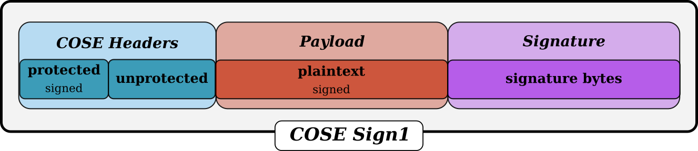

Sign1
=====

:class:`~pycose.messages.sign1message.Sign1Message` messages are used when there is single signature attached to the basic
COSE structure, consisting of headers and payload. Receivers must implicitly know the public key to verify the message
since no additional key information is transported.

.. module:: pycose.messages.sign1message

.. autoclass:: Sign1Message
    :members:
    :inherited-members:
    :exclude-members: from_cose_obj, record_cbor_tag
